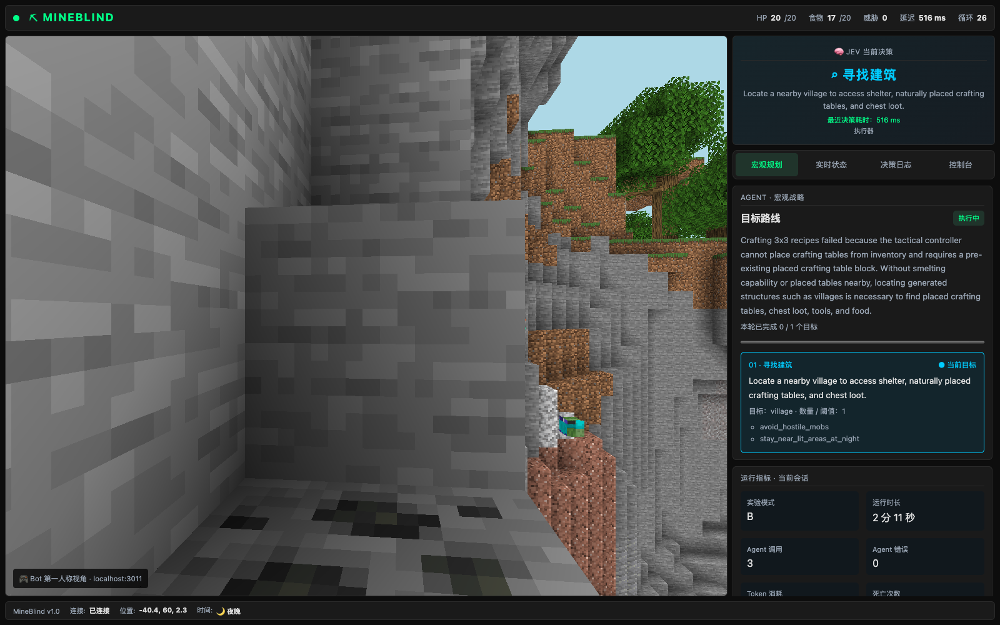
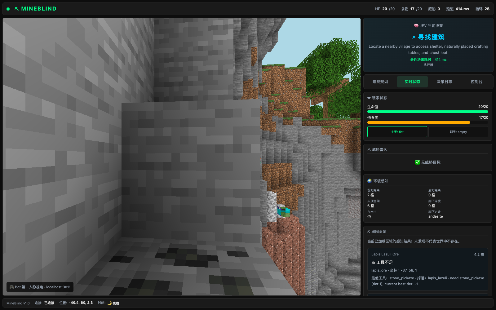
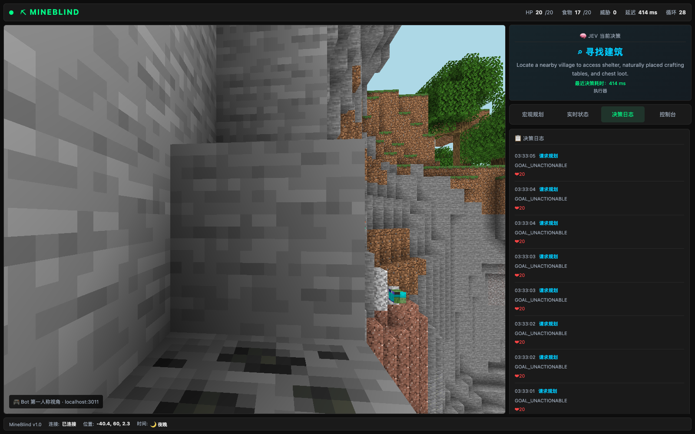

# MineBlind

Minecraft 分层自主控制实验：**Mastra Agent → Goal Manager → Jev → 持续技能 → Action Arbiter / Reflex**。

MineBlind 将长期规划、战术决策和即时动作拆开：战略 Agent 制定目标路线，Goal Manager 检查目标证据与进展，Jev 选择当前技能，Mineflayer 执行探索、采集、合成等动作；仲裁器和本地反射负责动作优先级与紧急打断。你可以通过浏览器实时观察机器人的第一人称视角、目标队列、环境感知和决策记录。

项目面向 Minecraft 自主智能体的开发、调试与消融实验，支持 A–E 五种模式、SQLite 世界记忆、状态存档与运行指标。设计见 [DESIGN.md](DESIGN.md)。**当前为实验实现，不是已经验证可自主通关的机器人。**

## 功能预览

以下图片来自本地 Docker 部署的真实运行页面：Minecraft Java 1.20.1、实验模式 B，使用 Chrome 在 1600 × 1000 视口中截取。画面和数据来自实际服务器与机器人，未注入演示数据。截图时机器人位于地下狭窄地形，正在经历合成失败后的重新规划；这是一组调试现场，不是自主通关展示。

### 第一人称视角与宏观规划

左侧为 Prismarine Viewer 的实时世界渲染，右侧展示当前战术决策、决策耗时、战略说明、目标路线及会话指标。默认方块手臂用于第一人称呈现，目前不包含皮肤、持物和挥动同步。战略说明是模型输出，应结合实际执行结果判断。



### 实时状态与资源感知

切换到「实时状态」，可以查看生命值、饱食度、手持物品、威胁、空间距离与周围资源。资源信息标注距离、坐标、最低工具要求和掉落物，帮助定位“看见资源却无法采集”的原因。感知只覆盖当前已加载区域。



### 决策日志与故障观察

「决策日志」记录时间、决策和当时生命值。此次运行中出现的 `GOAL_UNACTIONABLE` 表示当前目标不可执行，可与规划和状态面板交叉排查；界面正常连接不代表任务已经完成。「控制台」另提供暂停 / 继续及游戏声音开关。



图片文件位于 [`docs/images/`](docs/images/)，可点击查看原图。

## 启动

需要 Node.js 22.13+ 和 Minecraft Java 服务器（默认 1.20.1）。

```sh
npm install
cp .env.example .env
# 编辑服务器、实验模式、模型和密钥
npm test
npm start
```

HUD：<http://localhost:3010>，3D Viewer：<http://localhost:3011>。监控接口没有认证，请勿暴露到公网。游戏聊天支持 `!pause`、`!resume`、`!save`；旧 HUD 意图只保留逃跑、进食、放水和 Idle 暂停，其他旧战斗意图不再直接写 Mineflayer 控制状态。

## Mac Mini / Docker 部署

同时运行 Minecraft 服务器和机器人，见 [DOCKER.md](DOCKER.md)。提供原生架构 Dockerfile、健康检查、持久卷和本机绑定端口；Minecraft EULA 必须由你自行接受。已验证 AMD64 镜像构建与离线测试；本次截图亦验证了本机 ARM64 Docker 部署、Minecraft 连接及 HUD / Viewer 实时显示。完整自主行为、长期稳定性及通关能力仍待验证。

## SQLite 世界记忆（第一版）

运行时默认使用 Node.js 内置 `node:sqlite`（Node 22.13+；22.x 可能显示实验性警告），无需额外数据库服务。同步 SQL、WAL 和数据库检查点在独立 Worker 中执行，不进入物理反射循环。

- 已访问区块持久化，不再把全部区块常驻内存或发送给模型。
- 容器按维度和坐标隔离；数据库保留历史，内存热点最多 64 个，决策查询 48 格内最近 8 个，包含高度距离。`historical: true` 表示历史内容，不保证当前仍然存在。
- 事件增量写入；内存缓冲最多 1,000 条（溢出丢弃最旧条目），活动数据库最多保留 10,000 条详细事件。
- 模型接收有限世界摘要；自主运行间隔使用累计统计，最近样本最多 40 个。
- 所有 A–E 模式都使用世界记忆存储；模式 E 的“持久攻略缓存”仍是独立功能。

数据位于 `SAVE_DIR`：`memory/` 保存每次运行的活动数据库，`checkpoints/` 保存不可变数据库副本，原 JSON 存档通过 `sqlite_memory.json` 引用对应副本。设置 `RESTORE_SAVE=latest` 或指定存档目录恢复；恢复会复制对应检查点到新的运行数据库，不会混入后续运行的记忆。未设置恢复时开始新的记忆分支。备份请包含整个 `SAVE_DIR`，不要只复制 JSON 目录。这里恢复的是机器人状态，并不回滚 Minecraft 服务器世界。

旧 JSON 存档的区块和容器会在初始化时导入。旧容器缺少维度字段时按存档玩家维度导入（缺省为 `overworld`），无法自动还原过去混合维度的数据。

**当前边界：** 资源点长期检索、变化触发扫描、检查点自动清理尚未实现。每次存档仍生成完整 SQLite 副本，历史检查点及旧运行数据库会占用越来越多磁盘；不要将当前版本视为已经完成无限期运行的磁盘管理。JSON 控制状态仍沿用同步写盘。恢复采用对应数据库检查点，但不承诺游戏世界与机器人状态的跨系统原子快照。

## 消融模式

| 模式 | 战略 Agent | 效用门控 | Web | 持久攻略缓存 |
|---|---|---|---|---|
| A | 否 | 否 | 否 | 否 |
| B | 是 | 否（保留请求冷却与失败退避） | 否 | 否 |
| C | 是 | 是 | 否 | 否 |
| D | 是 | 是 | 是 | 否 |
| E | 是 | 是 | 是 | 是 |

设置 `EXPERIMENT_MODE=A`–`E`。B–E 使用 `AGENT_MODEL` 对应提供商的凭据，默认 `openai/gpt-4.1` / `OPENAI_API_KEY`。D–E 的 Agent 可通过 Tavily 搜索，需要 `TAVILY_API_KEY`。搜索结果只作为不可信参考信息；Jev 不可调用该工具。

### 自定义 OpenAI 兼容提供商

在本地 `.env` 中设置：

```dotenv
AGENT_PROVIDER=openai-chat
AGENT_BASE_URL=https://ai-gateway.pgthinker.me/v1
AGENT_MODEL=gemini-3.8-flash-high
AGENT_API_KEY=替换为你的密钥
```

`openai-chat` 使用显式 `.chat(model)`，请求 `POST /v1/chat/completions`；`openai-responses` 使用 `.responses(model)`，请求 `POST /v1/responses`。两者不自动回退；请按网关实际支持的端点选择。模型名原样发送，不加 `openai/` 前缀。密钥仅保存在已忽略的 `.env`，不要提交或写入日志。B–E 启用战略 Agent；A 不调用战略模型。恢复默认路由时设 `AGENT_PROVIDER=mastra` 和 `AGENT_MODEL=openai/gpt-4.1`，使用 `OPENAI_API_KEY`。

离线测试覆盖两种端点；该网关 Chat Completions 已验证普通回复及 Mastra 结构化规划。工具调用和流式响应仍需单独验证。所有启用 Agent 的模式均使用 `AGENT_COOLDOWN_MS` 冷却，失败指数退避最多五分钟，避免故障请求风暴。

没有 `JEV_API_KEY` 时使用本地战术选择器，**这种运行不能作为 Jev 实验结果**。Jev 请求失败也会记录错误并本地降级。没有 Agent 凭据不会伪造规划成功。

## 模块

- `src/agent/planner.js`：真实 Mastra Agent、Zod 宏观目标结构、缓存优先知识工具。
- `src/goal/manager.js`：库存/维度/结构/胜利证据、目标队列、区域探索进展、有限递归配方拆解。
- `src/jev/client.js`：systemone 技能选择和两类求助理由。
- `src/skills/executor.js`：九类持续技能，以及进食/放水反射。取消后等待原异步操作结束才允许新技能写入。
- `src/bot/arbiter.js`：P0–P4 仲裁、紧急打断和重新执行被打断技能。
- `src/memory/state.js`：30 秒 Working Memory、本局摘要、分维度探索记录、跨局攻略。
- `src/save/save_system.js`：原子快照和 JSONL 实验日志。
- `src/bot/runtime.js`：生命周期重规划、效用评分、状态广播、指标与自动保存。

门控严格采用 DESIGN 权重和边界：低于 0.5 拒绝，0.5–0.75 延迟，高于 0.75 批准。启动/死亡/失败/目标完成/维度变化属于生命周期事件，绕过效用评分；C–E 仍有冷却。求助遭拒时继续本地战术，不空转等待。

## 运行时事件处理

运行时采用“事件唤醒 + 定时兜底”，不需要 Redis 或外部消息队列：

- 健康变化立即执行已有本地反射检查；物理帧反射保持运行，不等待模型。
- 库存变化、技能结果、死亡/维度变化和继续运行会唤醒决策循环；50ms 合并窗口避免事件风暴，同一时间只有一轮决策。
- 战略事件使用有界优先队列，同类型事件合并计数；生命周期事件替换旧状态的待处理请求。异步处理只确认自己读取的事件版本，不会误删后来事件。
- 死亡、维度变化、暂停和非反射技能失败会使在途规划失效，旧结果不得覆盖新状态；主动失效造成的取消不计为提供商错误。
- 库存/健康变化本身不会直接调用战略模型；仍由目标判断、门控与冷却决定。事件唤醒不是并发规划，未结束的模型请求仍可能延迟下一轮战略决策；本地反射不受该等待影响。

该改造不增加新的危险识别能力，也不提供外部命令接口。目标证据仍在决策循环内校验，不保证在模型推理期间立即发现所有目标变化。真实服务器上的反应延迟和行为效果仍需集成验证。

## 存档与指标

每 `SAVE_INTERVAL_MS`（默认 5 分钟）、关键事件和退出时保存。设置 `RESTORE_SAVE=latest` 或快照目录可恢复；默认空值开始新运行，不交互询问。请设置 `WORLD_ID`，以避免同一端口更换世界后误用旧存档。恢复检查世界和实验模式。存档只保存 AI 状态，**不回滚 Minecraft 世界/背包**；连接后以实时观测校准。

目录默认为项目根目录下的 `data/saves/UTC日期/dayNNN_tHHMMSS_UUID/`。使用原子 `latest.json` 指针（路径相对 saves 根目录，兼容旧绝对路径）代替平台相关符号链接。Knowledge 独立存于 `data/knowledge/minecraft_mechanics/`，E 跨局复用，D 不读写该缓存。

游戏世界与服务器文件位于 `data/minecraft/`；SQLite、检查点、快照、实验日志及声音缓存都位于 `data/saves/`。原生启动脚本的日志/PID 位于 `data/logs/`、`data/pids/`。`SAVE_DIR`、`KNOWLEDGE_DIR` 支持覆盖（相对路径以项目根目录解析），已有 `.env` 需将旧的 `saves`、`knowledge` 改为 `data/saves`、`data/knowledge`；Compose 强制使用对应的 `/app/data/` 路径。迁移旧数据前先停服并完整备份，特别注意旧绝对路径存档指针，详见 [持久化与迁移](DOCKER.md#3-停止重启和持久化)。不要直接用空目录替换旧数据卷。

输出 Agent 调用/错误数、Token、死亡数、通关标志、平均调用间隔、自主目标完成归因比例。依赖率使用操作性近似：规划后的下一次已观测目标完成计为 Agent 解决；不是因果归因。调用间隔包括推理延迟和离线恢复时间，比较实验时需控制这些因素。

## 验证与已知边界

`npm test` 是纯离线测试，覆盖模式、门控边界、目标证据/停滞、维度隔离、指标、存档损坏/身份校验、缓存消融、异步取消/抢占和模拟 Mastra 输出。不会调用付费模型或连接 Minecraft。

已在本地 Minecraft Java 1.20.1 原有地下现场验证：机器人放置背包中的工作台、合成木镐，并推进到采集圆石目标。其余场景仍需集成验证，尤其传送、战斗与不同模型接口。当前限制：

- 配方拆解有限；支持放置背包中的工作台（识别 cave_air，必要时清理一个安全岩石格），但没有自动熔炼、完整装备进阶和食物生产。
- 合成执行前使用 Mineflayer `recipesFor` / `recipesAll`、`blockAt`、`canDigBlock` 做本地前置检查；失败按动作与局部环境/背包指纹退避 15 秒至 5 分钟，环境改变可提前重试。检查通过不代表路径、放置或服务器执行必然成功。HUD 与规划上下文包含失败原因和重试信息；重复失败检查点至少间隔 30 秒。
- Nether 门支持已有门或 **14 块黑曜石 + 打火石 + 平整无遮挡场地** 的保守构建，不支持岩浆浇筑；进入末地/末地门填眼未实现。
- 结构检测依赖附近可见的标志方块，不是完整遗迹识别，不使用 `/locate`。
- 战斗是基础近战，没有末影水晶、床爆、弓箭和龙阶段策略；不能据此宣称已完成末影龙目标。
- 防火/跌落放水是尝试动作，不保证成功；溺水专项救援未实现。
- Jev 只选择技能，参数来自战术目标；任意位置导航参数选择仍有限。

运行真实消融前应固定服务器版本/世界种子/初始库存，记录模型版本和是否发生本地降级，按多个种子重复试验。
